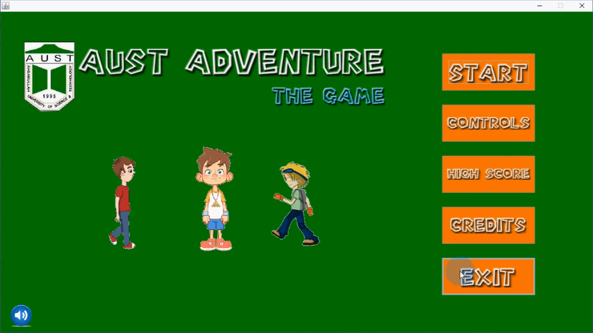

<h3>Project Name:</h3>Aust Adventure The Game (Java 2D Platform Adventure game).
<figure>
  
  <figcaption>Fig. - Cover Pic.</figcaption>
</figure>

This was our last semester "SD Lab Project" which we have made using Java Graphical User Interface Platform.
Which took almost more than 6 month.

<h4>Developed By :</h4>
<ul style="list-style-type:square">
<li>Sagor Ahamed</li>

<li>Nabil Ahmed</li>

<li>Shanjoy Paul Shuvo</li>
</ul>

<h2>Demo Video</h2>
<h5>Link:https://www.youtube.com/watch?v=-5Mwkd1733o</h5>
<h3>If You Like Please Subscribe To My Youtube Channel</h3>
<h5>Link: https://www.youtube.com/channel/UCiOisebyFCDWSFaabAyvZeg</h5>

